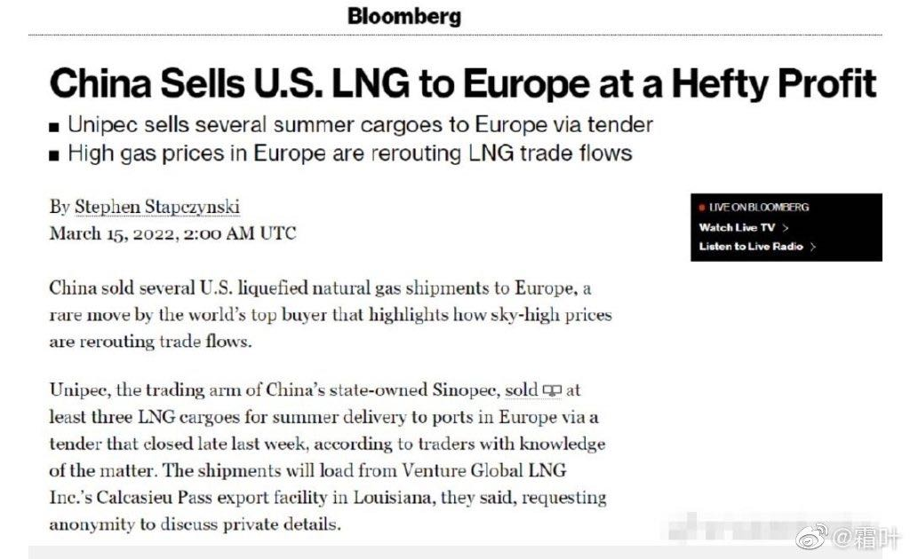

国际供应链上的祸福相依
^^^^^^^^^^^^^^^^^^^^^^^
**2022-3-26**

还记得在川普时代和中国的贸易战争吗？当年川普的一个“重大胜利”就是要求中国必须购买美国的页岩油和页岩气，并且双方也签订了长期的购买协议。

当下，在俄乌战争的大背景下，石油、天然气的能源价格飞涨，现在来看，当年中美之间所签订的能源价格简直就是白菜价了。面对欧洲各个国家限制了俄罗斯的能源而焦头烂额时，中国所采购的美国天然气成了市场上的新宠，一船一船的LNG在美国港口装船完毕就直接输送到欧洲了，这一进一出之间，让中国的购买方意外地大赚了一笔，谁能想到，当年被迫签下的协议，今天竟然成为了赚钱的买卖。国际局势的变化，往往会大大超出我们的想象，未来的环境变化也往往会落在我们能够设想的空间之外。中美欧俄之间，未来大国的博弈还会发生些什么？这个剧情往往真的超出了我们的想象。

.. note:: 俄乌战争带来的不确定性会让全球经济的动荡现象呈现更多的涟漪效应。

 - 能源价格上涨
 - 金属材料期现货市场动荡
 - 俄罗斯股票市场临近崩盘
